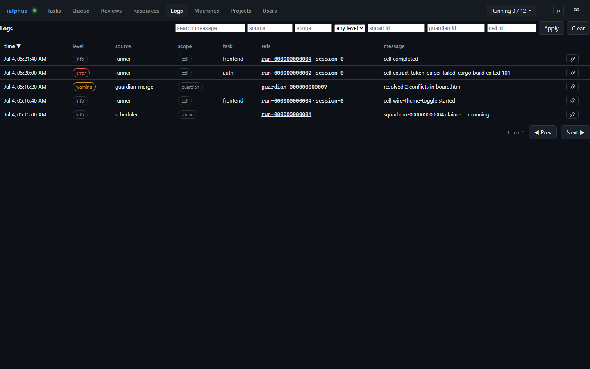

# Logs

Every notable event in the system — squad and task state transitions, cell
starts and completions, proof step results, Guardian review lifecycle
changes — lands in one unified, structured event log internally called
**Cartographer**. The Logs tab is where you browse, filter, and drill into
that log.

Each row is one event: **time**, severity **level** (`info`/`warning`/`error`,
plus `debug`/`trace` for noisier detail), the **source** that emitted it
(`scheduler`, `runner`, `guardian_merge`, ...), its entity **scope**
(`squad`/`cell`/`guardian`/`proof`, when the event concerns one), the owning
**task** name, and a **refs** chip linking back to the squad, cell, or review
that produced it — click it to jump straight there. Click a row itself to
expand its raw JSON payload (whatever structured detail was recorded
alongside the message, e.g. token counts and cost on a "cell completed"
event).

The filter bar across the top narrows by free-text message search, source,
scope, level, or an exact squad/guardian/cell id — useful both for "show me
everything that happened to this one squad" and broad triage across the
whole system. Only the **time** column sorts across every matching row on the
server; every other column header just re-orders the rows already on the
current page. A squad's own "Logs" modal and a review's "Logs" button both
open this same view pre-filtered to that one entity.
