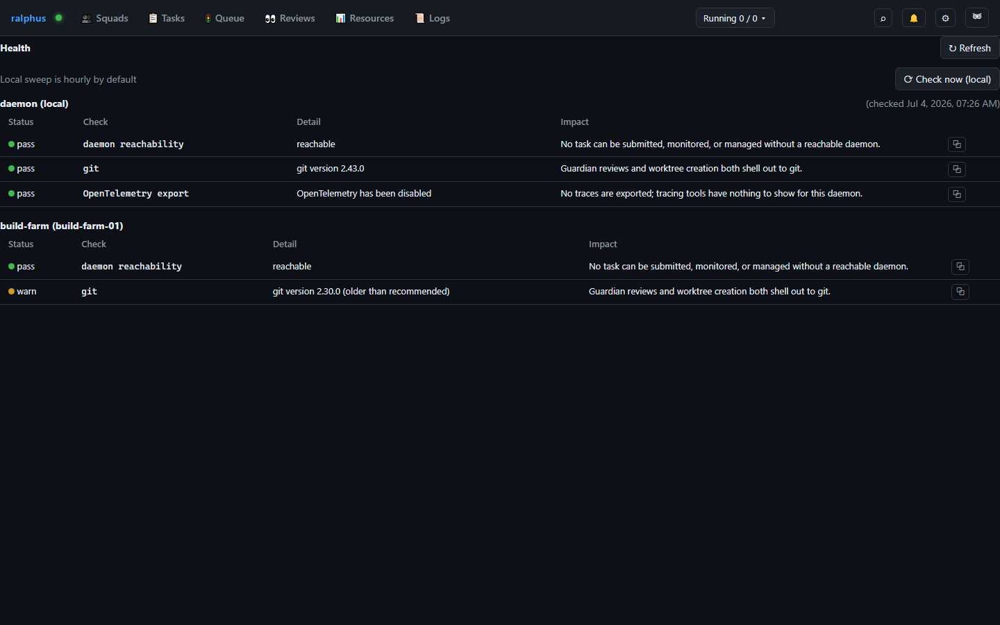

# Health

The Health tab (RAL-416) is a catalog-driven view of every check
`ralphus_core::health_catalog` knows about, joined against two live sources:
this daemon's own cached hourly Free-tier sweep, and every configured
`[machine.targets.*]` entry's always-live, on-demand report.

Each group is one host: this daemon's own row (labeled "daemon (local)")
alongside one row per registered remote target, in the same list. A row's
**Status** dot is pass/warn/fail/skip; **Check**, **Detail**, and **Impact**
come straight from the catalog entry, so a check the board hasn't seen a
matching catalog id for yet still renders using its raw id rather than
failing to display.

This daemon's own checks refresh automatically on an hourly background sweep
(`[health].poll_interval_secs`) rather than on every tab load, since some
checks shell out or hit the network — **Check now** re-runs them immediately
instead of waiting for the next sweep. Remote targets have no such cache:
they're always checked live when the tab loads or you hit the tab's own
Refresh, so there's no separate "check now" action for them. Admin-only
(RAL-332), same as Machines/Triage/Projects/Users/Secrets.
