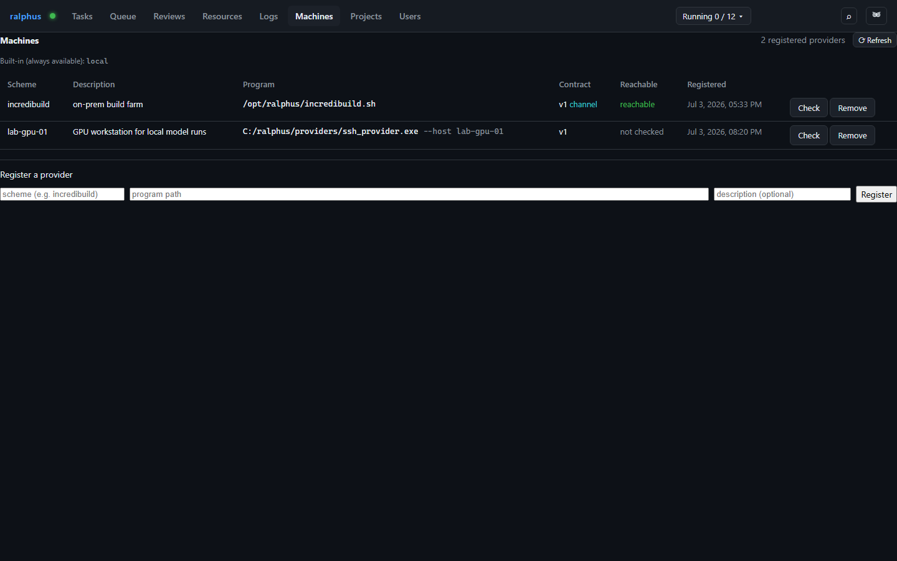

# Machines

A **machine provider** is the program the daemon runs to reach machines
under one scheme — what lets a task, cell, proof step, or review declare
`machine = "<scheme>:<uri>"` and have the daemon dispatch it somewhere other
than its own host. The Machines tab is where providers are registered and
checked.

Each row is one registered provider: its **scheme** (the left half of a
`machine` value, matched case-insensitively), a **description**, the
**program** the daemon invokes (plus any arguments always prepended before
the verb), the provider-**contract** version it was registered against (and
a `channel` badge if it reuses one long-lived process instead of spawning
per command), whether it's currently **reachable**, and when it was
**registered**. `local` — listed separately as always available — is the
built-in scheme every project resolves to without a registry row at all.

**Check** probes one provider on demand via its `ping` verb and records the
result; reachability is never polled automatically, since probing spawns the
provider program and a board refreshing every couple of seconds would turn
that into steady background load on a build farm. **Remove** deregisters a
provider — a task submitted afterwards naming that scheme is rejected at
submit time, though any squad that already resolved the machine keeps
running unaffected. Registering a provider is deliberately an administrative
action here rather than something declarable in a task file: a provider
entry names a program the daemon will run, so a task file that could both
name and define one would make submitting a task equivalent to running
arbitrary code.
