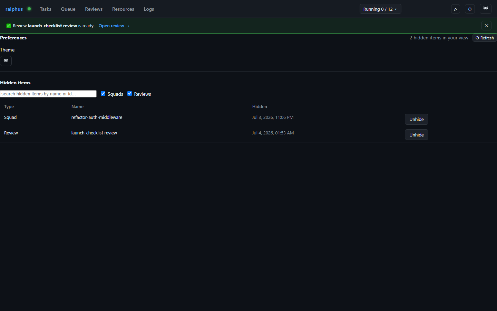

# Preferences

The **Preferences** tab (RAL-329) is your personal view settings — it only
changes what you see; it never changes the underlying squad or review, and
nobody else's view is affected. Your identity is resolved from the
`X-Ralphus-User` header, falling back to `[daemon].default_user` — there is
no sign-in yet (RAL-252).

**Hidden items** lists every squad or review you've hidden elsewhere in the
board (RAL-328) — a way to declutter the Tasks/Reviews tabs without deleting
anything. Filter by type (Squad/Review) or free-text search, and **Unhide**
to bring an item back into your own view.

**Edit Profile (RAL-332).** An admin visiting another user's page from the
Users tab sees this same tab scoped to that user instead of their own — a
banner marks the visit and every visit is logged to Cartographer for
auditability. The view ends the moment the admin navigates anywhere else; it
never persists and never swaps the admin's own session or filters.
