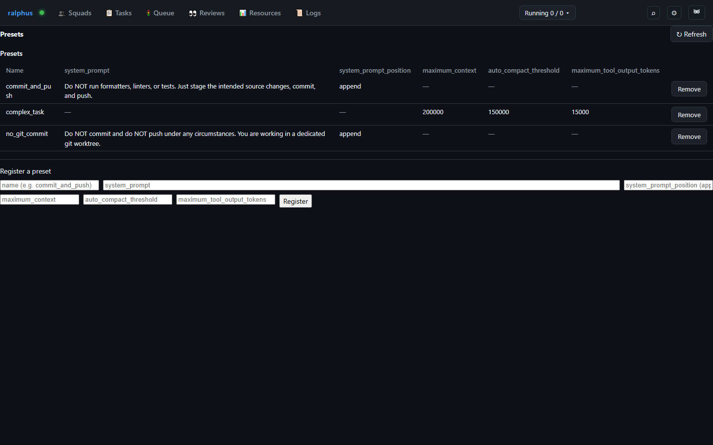

# Presets

**Presets** are named bundles of field defaults an `extends =
["<<ralphus:presets/<name>>>"]` entry stamps into a task's, cell's, or
proof step's own unset fields when the squad is submitted — so common
boilerplate (a "commit and push" system prompt, a "complex task" context
sizing triple) doesn't need to be retyped into every cell. Admin-only
(RAL-332).

A field the entity already set explicitly is **never overridden** — a
preset only ever fills a field left unset. When more than one preset in the
same `extends` list defines the same field, **the last one listed wins**. A
preset field that doesn't apply to the entity kind it's referenced from
(e.g. `system_prompt` via a task-level `extends`) is **silently skipped**,
not an error — only `maximum_context`, `auto_compact_threshold`, and
`maximum_tool_output_tokens` apply to a task; `system_prompt` and
`system_prompt_position` are cell-only; only `maximum_tool_output_tokens`
applies to a proof step.

Manage presets here, via `ralphus preset register/list/get/deregister`, or
through the matching MCP tool — all three read and write the same
daemon-registered registry. Deregistering a preset never touches a squad
that already had its fields stamped from it; only a future submission's
`extends` referencing that name is affected.
