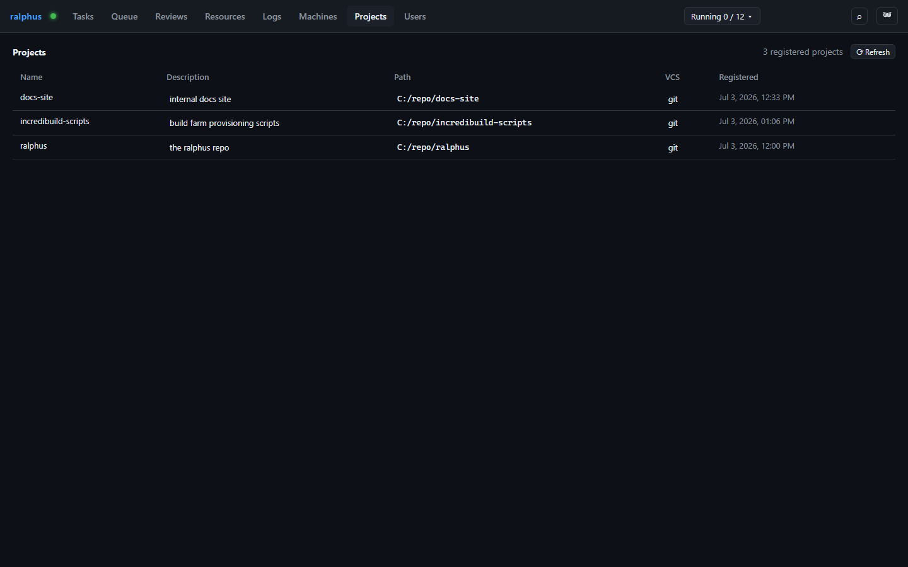

# Projects

A **project** is a registered git repository a task's cell `cwd` can
materialize a worktree under — registering one is what lets a task file use
the `ralphus:new-worktree/<branch>?upstream=<upstream>` placeholder instead
of a hardcoded filesystem path. The Projects tab is where you manage that
registry.

Each row is one registered project: its unique **name** (what a task's
`project` field references), a human-readable **description** (also used for
fuzzy project lookup by name or description), the absolute **path** to its
git repository root, the **VCS** kind (only `git` is implemented today), and
when it was **registered**. Double-click the description, path, or VCS cell
to edit it in place, then **Save** or **Cancel** — the name itself can't be
renamed here.

Every row is re-validated once per tab-load (and again on demand via
**⟳ Refresh**): the daemon re-checks that the path still exists and is still
a git working tree, without writing anything. A row that fails validation is
highlighted in red — hover its name for the reason (moved, deleted, or no
longer a repository).
