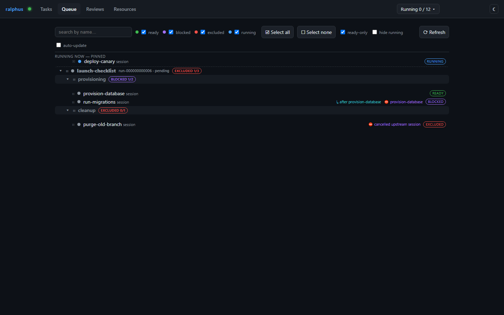
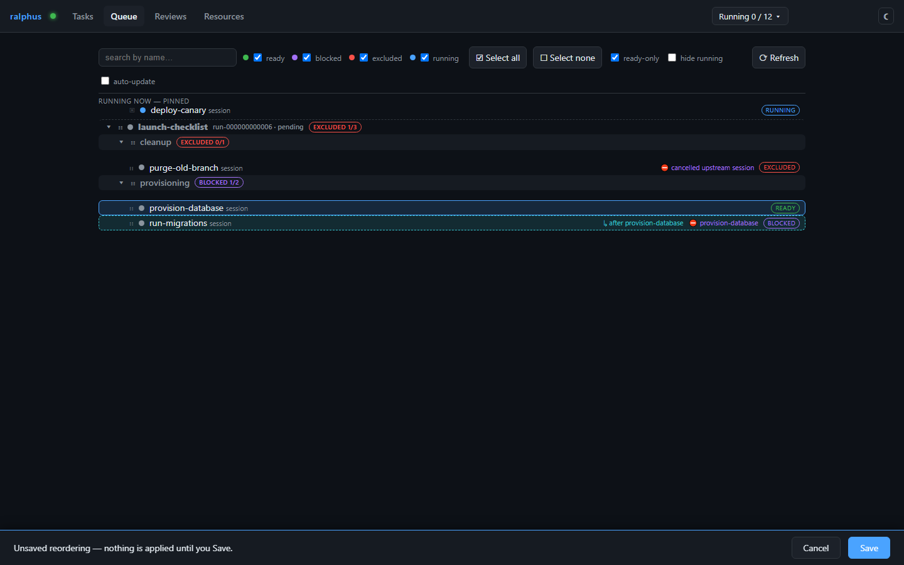

# Queue

The scheduler always runs whatever is dependency-ready, up to the
concurrency limit — but when several things are ready at once, *which one
goes first* is a priority call ralphus can't make for you. The Queue tab is
where you make it: drag ready-to-run sessions and verify steps into the
order you want them picked up. Order here is a best-effort hint honored the
next time a compute slot frees, not a hard guarantee.

## The list

Each row is one **session**, **session-level verify step**, or **task-level
verify step**, grouped under collapsible run and task headers. The badge on
the right is its **readiness**:

- **ready** — nothing is stopping it; it'll be picked up as soon as a slot
  frees.
- **blocked** — waiting on something else in the queue (shown inline, e.g.
  `run-migrations` waiting on `provision-database`).
- **excluded** — a dependency has already terminally failed or was
  cancelled, so this item can't ever become ready without intervention.
- **running** — already in flight. Running work is pinned to the top of the
  list and can't be reordered — nothing can be scheduled ahead of work
  that's already started.

## Dragging, and the lazy-anchoring rule

You can drag any ready/blocked/excluded row (not a running one) to reprioritize
it. But a raw reorder could easily produce nonsense — a session ranked ahead
of the very dependency it needs. Instead of rejecting the drop or forcing you
to move both rows yourself, the Queue applies a **lazy, anchored repair**:
the item you dragged lands exactly where you dropped it (the anchor); only
the *minimal* set of other items move to keep every dependency ordered before
its dependent.

Compare this to the list above: `provision-database` (a dependency) was dragged
down past its dependent `run-migrations` and dropped at the very end of the
list. Left alone, that would put the dependency after the thing that needs
it — invalid. Instead, `run-migrations` is automatically pushed down to sit
right after it (highlighted as "pulled along" in the UI) so the order stays
valid, while everything unrelated (`purge-old-branch`) is left exactly where
it was. Drag the *dependent* upward past its dependency instead, and the
rule runs the other way: the dependency gets pulled up to sit right before
it.

Nothing is sent to the server until you click **Save** — drag around freely,
and **Discard** reverts to the last saved order if you change your mind.
