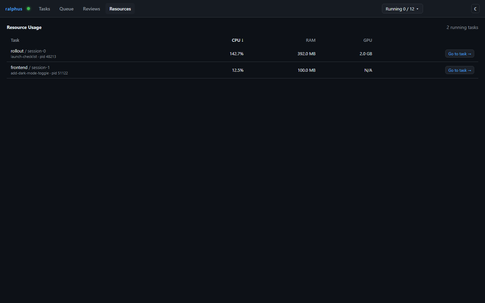

# Resources

A quick way to spot a runaway process: the Resources tab lists live CPU,
RAM, and GPU usage for every session that currently has a runner subprocess
in flight.

Each row is one running session — its task/session name, owning run, and OS
process id, alongside sampled CPU percentage (of one core; can exceed 100%
for multi-threaded work), resident memory, and GPU memory if it could be
attributed to that process (`N/A` when GPU metrics aren't available, e.g. no
`nvidia-smi` on the box). Click any column header to sort by it. **Go to
task →** jumps straight to that exact session in the [Tasks](tasks.md) tab.

This tab only samples while it's open — CPU sampling briefly blocks to
compute a delta, so it isn't polled in the background on other tabs.
