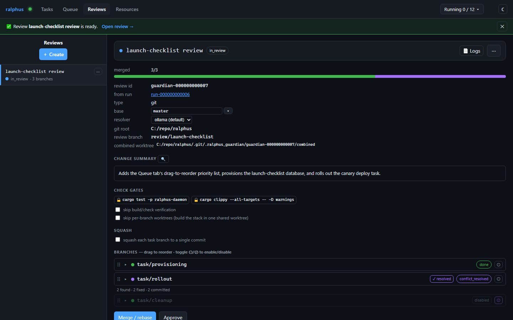
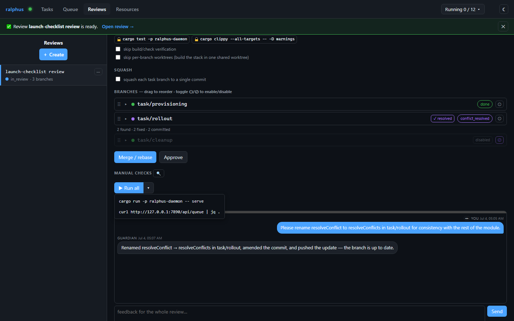
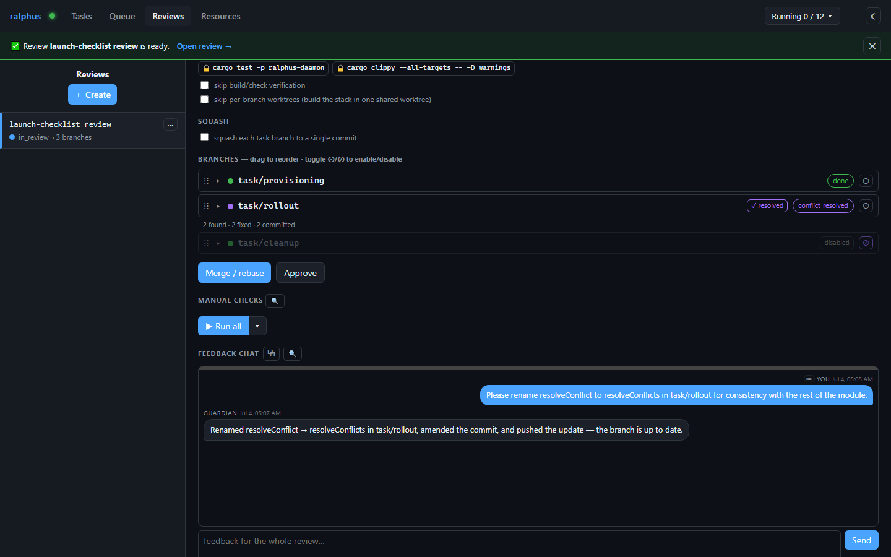

# Reviews

A Guardian review takes the branches produced by a squad's tasks and stacks
them into a single rebased review branch — resolving merge conflicts with an
agent, running your declared check gates, and giving you a per-branch
feedback thread to request changes before anything is approved. The Reviews
tab is where you watch and steer that process.

## Branch order — and how it relates to task dependencies

A review's branches start out in the same order as the task dependency graph
they came from — if `rollout` depends on `provisioning`, its branch is
initially stacked after `provisioning`'s. But that's just the *starting*
order, not a constraint: you're free to drag branches into a different merge
order any time before the review is approved (the grip handle on each row),
the same lazy-anchoring drag mechanics as the [Queue](queue.md). Reordering
only changes how the stack is rebuilt going forward — it doesn't touch
anything that already merged.

You can also **disable** a branch (the ⊙/⊘ toggle on each row) to drop it
from the rebase stack entirely without losing it — a disabled branch stays
visible and can be re-enabled later. In the screenshot above, `task/cleanup`
has been disabled: it's excluded from the current merge but still listed.
Both reordering and enable/disable are staged locally and only take effect
once you click **Save**, which re-runs the stacked rebase in the new shape.

## Running manual checks

Alongside the automated check gates, an agent suggests shell commands worth
running by hand to sanity-check the change (regenerated every time the
branch is rebuilt). **▶ Run all** launches every suggested command at once in
a new terminal in the repository root; the **▾** next to it opens the
individual commands so you can run just one.

## Feedback

Expand a branch's detail view to see its own read-only feedback thread and
post a note. The guardian agent applies your feedback directly in that
branch's review worktree, amends the affected commit, and pushes the update,
posting a short acknowledgment back to the thread. The branch's merge status
and the change summary refresh automatically once that lands, so you see the
result of your feedback without triggering anything yourself.
