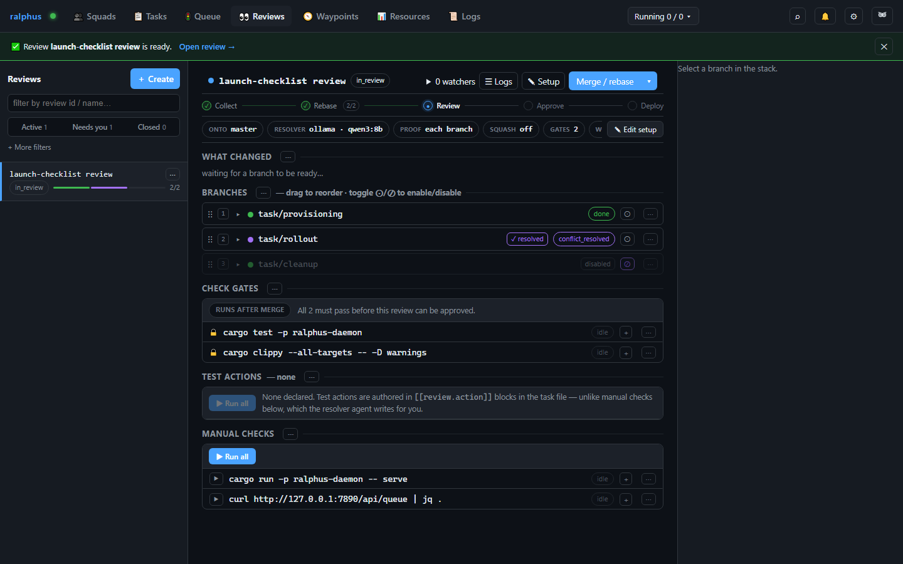
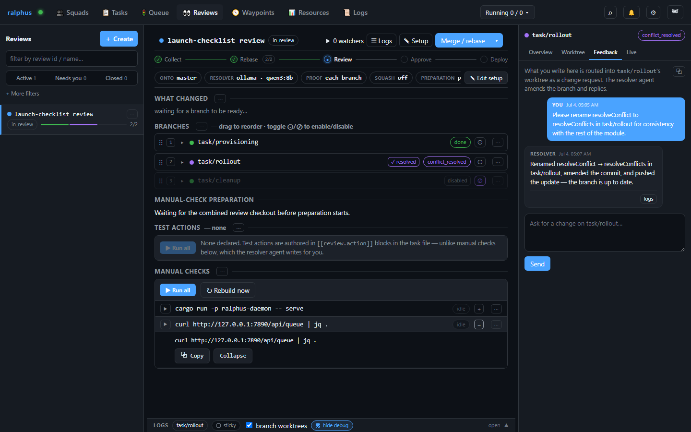
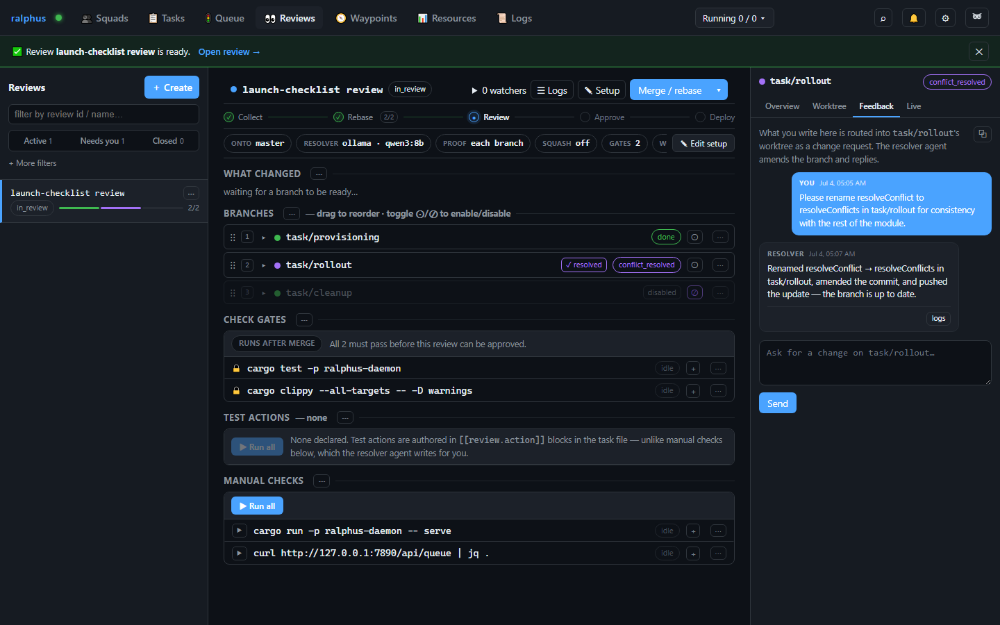

# Reviews

A Guardian review takes the branches produced by a squad's tasks and stacks
them into a single rebased review branch — resolving merge conflicts with an
agent, preparing optional manual checks, and giving you a per-branch
feedback thread to request changes before anything is marked merged. The Reviews
tab is where you watch and steer that process.

## Branch order — and how it relates to task dependencies



A review's branches start out in the same order as the task dependency graph
they came from — if `rollout` depends on `provisioning`, its branch is
initially stacked after `provisioning`'s. But that's just the *starting*
order, not a constraint: you're free to drag branches into a different merge
order any time before the review is merged (the grip handle on each row),
the same lazy-anchoring drag mechanics as the [Queue](queue.md). Reordering
only changes how the stack is rebuilt going forward — it doesn't touch
anything that already merged.

You can also **disable** a branch (the ⊙/⊘ toggle on each row) to drop it
from the rebase stack entirely without losing it — a disabled branch stays
visible and can be re-enabled later. In the screenshot above, `task/cleanup`
has been disabled: it's excluded from the current merge but still listed.
Both reordering and enable/disable are staged locally and only take effect
once you click **Save**, which re-runs the stacked rebase in the new shape.

## Running manual checks



An agent suggests optional shell commands worth running by hand to sanity-check
the change. Ralphus prepares their checkout and declared artifacts before any
Run button enables. The suggestions are computed once,
when the review's branches are first created, and then kept through later
merges, rebases, and automated fix iterations — manual checks describe review
work that doesn't change across an ordinary rebase, so ralphus doesn't spend
another agent run re-deriving the same list. If your workflow needs fresh
suggestions on every rebuild instead, turn the caching off: set
`[[review]] cache_manual_checks = false` on the review (or a `[review]
cache_manual_checks = false` project default) and every later merge or rebase
regenerates the commands from the freshly stacked diff.

To turn the agent-suggested commands off entirely, set `[[review]]
skip_manual_checks = true` on the review (or a `[review] skip_manual_checks =
true` project default, or the matching control in the review's Setup modal).
No agent is asked to propose commands for that review; manual checks you
declared yourself in the task file are unaffected.

To have ready manual checks run by themselves, set `auto_run = true` on a
check (`[[review.action]]`), on the review (`[[review]] auto_run = true`), or as
a project default (`[review] auto_run = true` in `.ralphus.toml`, or the
"auto-run manual checks after build" control in the Setup / Review Settings
modals). The most specific setting wins (the check, then the review, then the
project); nothing set means off. A check runs the moment its build commands
succeed (immediately if it has none), once per machine per build, in a terminal
you can watch on the daemon's machine, and its `cleanup_command` runs first. Only
checks whose inputs all have defaults run; one that needs a value shows a
warning on its row instead.

If a rebase, reviewer feedback or an auto-PR fix arrives while an auto-run is
still going, nothing is killed. The row shows a warning ("Your check environment
may be out of date. Consider closing and re-running.") and you get a
notification. A failing auto-run sends an informational notification and leaves
the review as it was; its result is badged **auto** so you can tell it from a
run you started.

When a submission defines its own checks they are used as written. A project's
`.ralphus.toml` can suggest checks with `[[review.action]]` and say when each
applies with `[[review.action.hint]]`, but those only inform whoever writes the
submission and are never layered on top of it: if they
were, a submission and its project that differ even slightly would stop **Run
all** from running just the small set of checks you chose.

### When the prepared build is rebuilt

By default every rebase, every applied piece of reviewer feedback, and every
unattended auto-fix pass tears the prepared build down and builds it again, so
a ready action always matches the current stack. If that is more rebuilding than
you want, set `[[review]] rebuild_on` (or a `[review] rebuild_on` project
default) to just the events that should rebuild:

```toml
[[review]]
id = "ralphus:new-review/my-review"
rebuild_on = ["rebase"]   # rebuild on a rebase; keep the build through feedback and auto-fix
```

The allowed entries are `"rebase"`, `"feedback"` and `"auto_fix"`. An event left
out keeps the ready build exactly as it is — its actions stay ready and nothing
is torn down or rebuilt. An empty list, `rebuild_on = []`, never rebuilds
automatically, so you rebuild only when you ask: `ralphus review rebuild
<selector>` tears the build down (running each action's
`[review.action.lifecycle] before_reset_command` teardown commands first) and
builds it again whatever `rebuild_on` says. A review with no ready build yet
always builds, so the first build is never skipped. The same list is editable
per review with `ralphus review settings <selector> --rebuild-on ...` and per
project with `ralphus project review-settings set <project> --rebuild-on ...`.

**▶ Run all** launches every ready suggested command at once in its prepared
checkout. It never performs a build or transfer. An action stays disabled and
shows `preparing`, `transferring`, or an actionable failure until its setup is
complete. These outcomes are useful history but never block approval.

## Feedback



Expand a branch's detail view to see its own read-only feedback thread and
post a note. The guardian agent applies your feedback directly in that
branch's review worktree, amends the affected commit, and pushes the update,
posting a short acknowledgment back to the thread. The branch's merge status
and the change summary refresh automatically once that lands, so you see the
result of your feedback without triggering anything yourself.

That feedback routing (what the word does in reviewer mode — and what it
doesn't — plus the per-branch selector and restack effects) is documented in
the repo's [special syntax & markers](../special-syntax.md) guide.

A [waypoint](waypoints.md) (RAL-400) rostering this review delivers its
guidance through this exact same path: the bearing is posted as synthetic
feedback into the review's topmost ready branch, so it amends and pushes —
and restacks anything downstream — exactly as a human's feedback would. The
roster entry is recorded `delivered` once that post succeeds; it never needs
its own separate injection mechanism.
