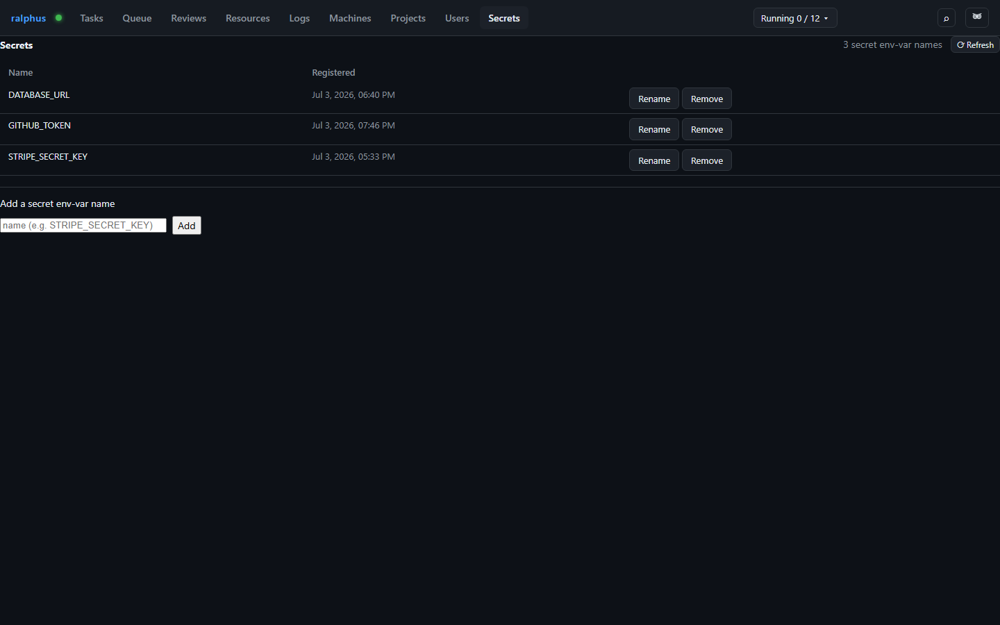

# Secrets

The Secrets tab registers **env-var names** to treat as secret (RAL-281) —
not the secret values themselves, which are never sent to or stored by
ralphus. A cell or proof step's resolved environment is checked by exact
name against this list; a match scrubs that variable's *value* from durable
pane text and terminal logs, in addition to the existing `from_env`-sourced
agent-profile secrets. Changes apply immediately, with no daemon restart
needed.

Each row is one registered name and when it was **registered**. **Rename**
lets a new name take over redaction coverage immediately; the old name stops
being treated as secret. **Remove** stops treating a name as secret going
forward — this cannot be undone, and values already redacted in existing
pane text/terminal logs stay redacted.

Adding a name validates it as a real environment-variable identifier
(starts with a letter or underscore, then letters/digits/underscores) and
rejects a name that's already registered rather than merging it.
