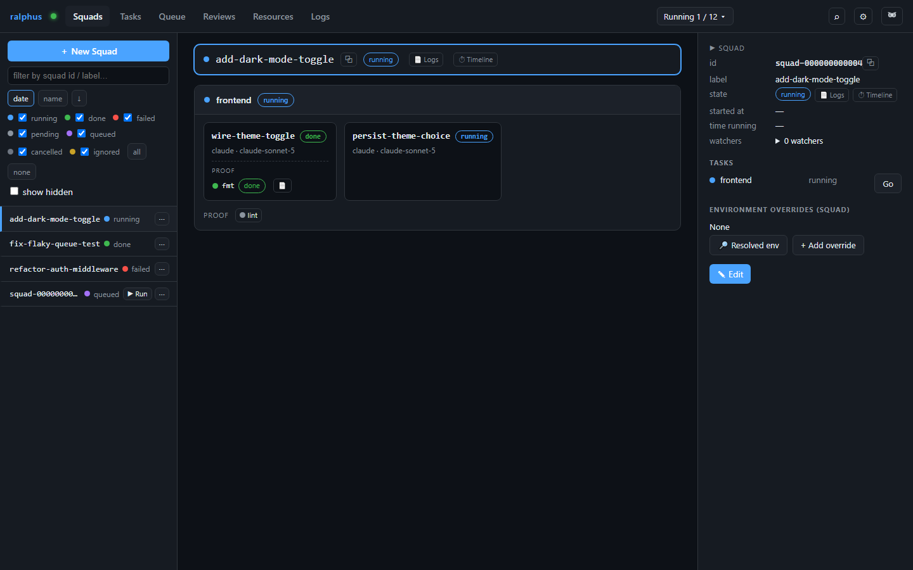
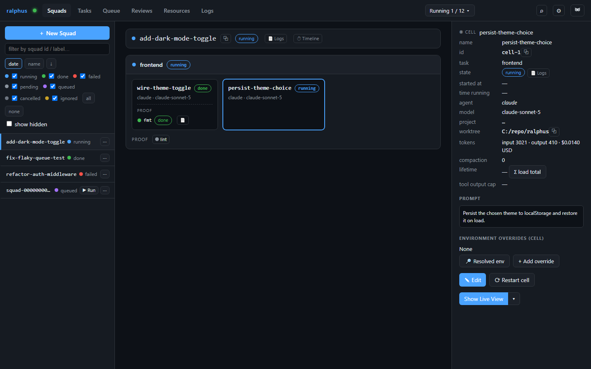

# Squads

The Squads tab is the default view and the one you'll live in most: every
squad you've submitted, its tasks and cells, and the full detail of
whichever one you've selected.

## The board at a glance

The **left sidebar** lists every squad, newest first, filterable by status
and searchable by id/label:

- The colored dot + label is the squad's **state** — `running`, `done`,
  `failed`, or `queued` (held back with `hold=true`, waiting to be
  activated). A `queued` squad shows a `▶ Run` button right there in the
  sidebar.
- Below the label, the small meta line repeats the state as text and (for
  anything past `pending`/`queued`) offers a logs shortcut.
- Right-click any squad for rename / retry / restart / cancel / delete, or to
  manually override its status.

The **main pane** shows the selected squad's task tree: each task's name,
state, and declared task-level proof steps, with its cells nested below.
In the screenshot above, `add-dark-mode-toggle` is `running` — one cell
(`wire-theme-toggle`) already finished and its `fmt` proof step passed;
the second cell (`persist-theme-choice`) is still in flight and depends
on the first.

## Selecting a cell

Click any cell to open its **details pane**: the resolved agent and
model, token/cost counters, the prompt or command it ran, its own dependency
(`persist-theme-choice` waits on `wire-theme-toggle`, shown above), and any
cell-level proof steps. This is where you'd go to read exactly what an
agent was asked to do and what it reported back — the same pane a
`command`-kind cell shows its captured output in.

## Where task state comes from

A task's state rolls up from its cells and proof steps — it only counts
as `done` once every cell has finished and every proof step has passed.
A `failed` cell (like `extract-token-parser` in the `refactor-auth-
middleware` squad) fails its owning task, and any task-level proof step
attached to it is shown alongside the failure so you can see exactly which
check caught it.