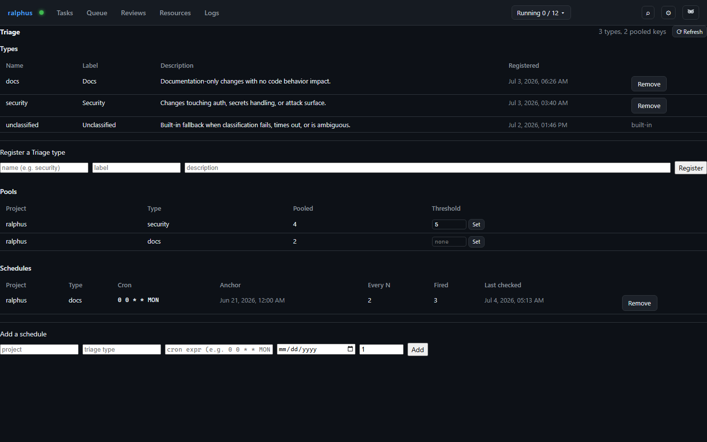

# Triage

**Triage** (RAL-318) is an alternative to naming an explicit `[[review]]` on
a cell: set `triage = true` instead, and the Arbiter classifies the cell
into one of the registered Triage types below. Classified cells from any
squad sit **pooled** per `(project, triage_type)` key until a count
threshold or a cron schedule fires, then the whole pool drains into one
fresh review at once. Admin-only (RAL-332).

**Types** is the registry every cell's inline `triage_type` value (or the
Arbiter's own classification) resolves against. Each type's **description**
feeds the Arbiter's classification prompt alongside every other registered
type's description, so write it to distinguish this type from the others.
`unclassified` is a built-in that always exists and can never be
deregistered — it's the permanent, single-attempt fallback assigned when
classification fails, times out, or is ambiguous.

**Pools** shows current pooled-cell counts per key, with an inline
**threshold** editor: draining creates a review once a pool holds that many
cells. Clear the field to remove the count-based trigger — a pool with
neither a threshold nor a schedule simply accumulates until one is added.

**Schedules** are cron-based drain triggers, evaluated in UTC. A pool may
have several active schedules at once (e.g. "every other Monday" *and*
"every 3 months") alongside an independent count threshold — whichever
fires first drains the pool and resets its own counter/timer; no cell is
double-counted across drains. **Every N** fires on every Nth occurrence of
the cron expression counted from the **anchor** date, so "every other
Monday" or "every 3 months" can be expressed precisely rather than
approximated by the cron expression alone.
