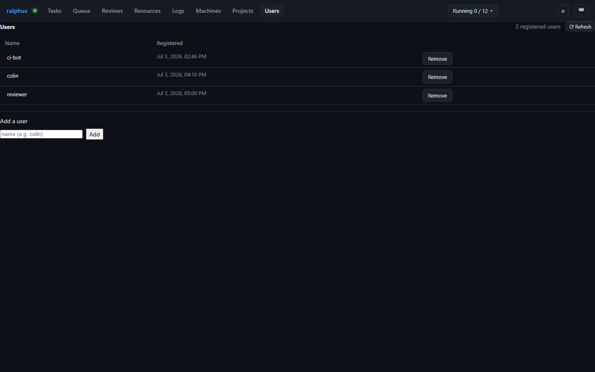

# Users

A **user** here is a placeholder identity a request can attribute itself to
— not authentication. There's no password, no session, and no permissions
attached; a name grants nothing on its own, and any caller can claim a
registered name via `?user=` or a `default_user` config value. The Users tab
is where these placeholder identities are registered and renamed.

Each row is one registered user: its **name** and when it was
**registered**. Double-click a name to rename it in place — a request
already using the old name keeps working under it until it re-claims the new
one. **Remove** deletes the registration entirely; this only stops the name
from being selectable going forward and cannot be undone.

This tab is intentionally minimal because the feature behind it is: real
per-user authentication and permissions are tracked separately and not yet
built, so treat every name here as a convenience label, not a security
boundary.
