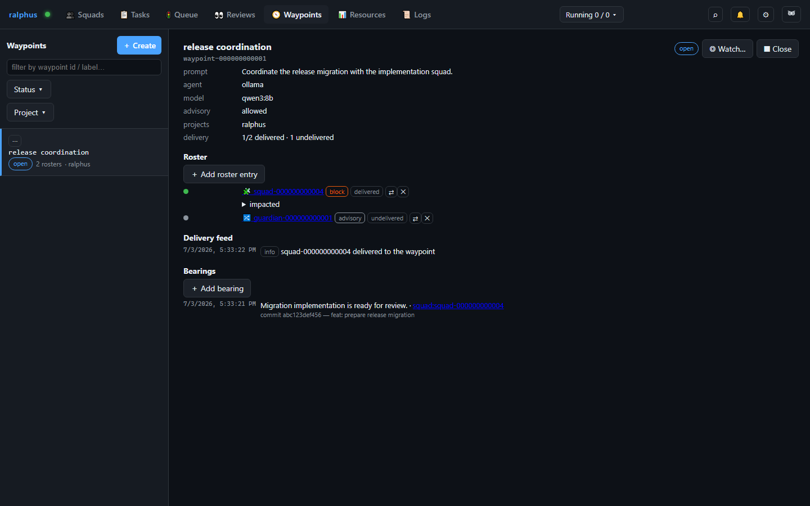

# Waypoints

A **waypoint** (RAL-400) is a cross-squad coordination join point: a named
prompt plus a **roster** of squads and/or reviews that must (block mode) or
may (advisory mode) check in before the waypoint's own coordinated work is
considered settled. Where a [Review](reviews.md) stacks branches *within* one
squad's tasks, a waypoint tracks impact *across* squads and reviews that
otherwise have no dependency edge between them — the roster is exactly the
set of other things a piece of work needs to keep in sync with.

## Sidebar: filtering by state and project

The sidebar lists every waypoint, newest first, with **Status** (open/closed)
and **Project** filter dropdowns matching the same conventions as the
[Reviews](reviews.md) and [Squads](squads.md) sidebars, plus a free-text
filter over label/id. Each row shows the waypoint's label (or id), its
open/closed badge, its roster size, and the projects inferred by hopping
through its roster's squads/reviews.

## Detail pane: settings, roster, delivery feed, bearings

Selecting a waypoint shows:

- **Settings** — the `prompt` sent to the survey agent, the `agent`/`model`
  pair used to run it, whether `allow_advisory` roster entries are permitted,
  the inferred project list, and a rollup of roster delivery status
  (delivered / via restack / failed / undelivered).
- **Roster** — one row per tracked review or squad, each showing a
  delivery-status dot, a deep link to the entity itself, its block/advisory
  mode badge (toggleable in place), and — once the survey pass has run — an
  expandable verdict and rationale. **＋ Add roster entry** adds a squad or
  review by id and kind; each row's **✕** removes it.
- **Delivery feed** — a chronological, Cartographer-backed event list for
  this waypoint: creation, survey verdicts, deliveries, closes/reopens. This
  feed *is* the waypoint's timeline; there is no separate timeline view.
- **Bearings** — the append-only chronicle of completed work reported against
  this waypoint: a summary, an optional entity link, and an optional git
  commit id + one-line summary. **＋ Add bearing** appends a new entry;
  existing entries can never be edited or removed.

**■ Close** / **▶ Reopen** manually override a waypoint's open/closed state
(a waypoint also closes itself automatically once every blocking roster
entry has delivered). **◎ Watch…** wires the same mailbox-notification
preferences used elsewhere in the board.

## Adding entries from elsewhere in the board

Squad and review context menus include an **"Add to waypoint…"** entry so
you can roster an existing squad or review without switching to this tab
first — it opens the same add-roster-entry flow described above, pre-filled
with the entity you right-clicked.

## Injection contract

An impacted squad's cells and proof steps receive their waypoint's roster
entry as coordination context (prompt, current bearings, and any linked
commit summaries) — not as a substitute for reading the actual diff. See
[Special syntax & markers](../special-syntax.md) for the exact sentinel
grammar (`<<review:<id>>>`, `<<squad:<id>>>`, `<<ralphus:new-squad>>`) used
to reference a roster entry from a waypoint's prompt.
