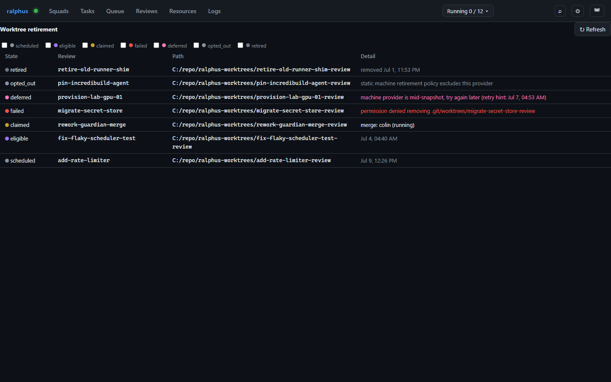

# Worktree retirement

The **Worktree retirement** tab (RAL-385/386) lists every review worktree
across every review, classified by its retirement lifecycle state. A daily
daemon sweep removes review worktrees idle 30+ days; anyone watching a
review gets one mailbox heads-up before its worktree is actually removed.
Originally a popup reachable from the Reviews tab, it now lives here as its
own admin-only tab, gated in the UI the same way as Machines/Triage/
Projects/Users/Secrets — though the underlying data is not restricted:
any user can pull the identical view with `ralphus review
worktree-retirements`, admin or not.

Each row is one worktree with a **state**: **scheduled** (too young to
retire yet), **eligible** (old enough — the advance mailbox notice has gone
out, the next sweep removes it), **claimed** (held by a live task/proof/
review claim, so the daemon keeps it and raises a mailbox escalation
instead), **failed** (a retirement attempt was refused — the error stays
visible until a retry succeeds), **deferred** (a machine provider asked to
try again later — not a failure), **opted_out** (a machine provider, or an
operator's static retirement policy, declined to ever retire this worktree
automatically — also not a failure), or **retired** (removed; the row
stays visible for as long as the review exists). The filter chips above the
table narrow the list to one or more states at a time.

The **Detail** column adapts to the state: the blocking claim for
**claimed**, the error for **failed**, the provider's reason (plus an
optional retry hint) for **deferred**, the decline reason for
**opted_out**, the eligible-at time for **scheduled**/**eligible**, or the
removal time for **retired**.

## Transcript and pane-snapshot retirement (RAL-348)

When a worktree actually retires (the **retired** state above), the daemon
also deletes every pane-snapshot and terminal-log transcript file under
`~/.ralphus` left behind by any cell or proof session that ever ran with
that worktree as its working directory — across every attempt and restart,
for the entire lifetime of the worktree. This piggybacks on the sweep
described above rather than running on its own timer: a worktree only
reaches **retired** once every claim against it is terminal, so this never
touches a transcript or snapshot still tied to live or recent squad, task,
or cell state.

There is no separate retention policy or configuration surface for
transcripts/pane-snapshots — they inherit whatever worktree-retirement
policy already applies to the project (age threshold, per-machine
opt-out, etc.). A project with no worktree-retirement override simply has
no override for this either.

This deletes outright; it does not archive. Local worktree pruning is safe
to do unconditionally because the branch/commits still live on the remote,
but transcripts and pane snapshots have no such backup today. Archiving
them somewhere before deletion is a deliberately deferred future
improvement, not an oversight.

(`.log`/`.raw` terminal-log files are also independently aged out by
`TerminalLogConfig`'s own retention-days/max-files cap on the regular
scheduler tick, regardless of worktree state — that pre-existing scheme is
unrelated to and unaffected by this section.)
